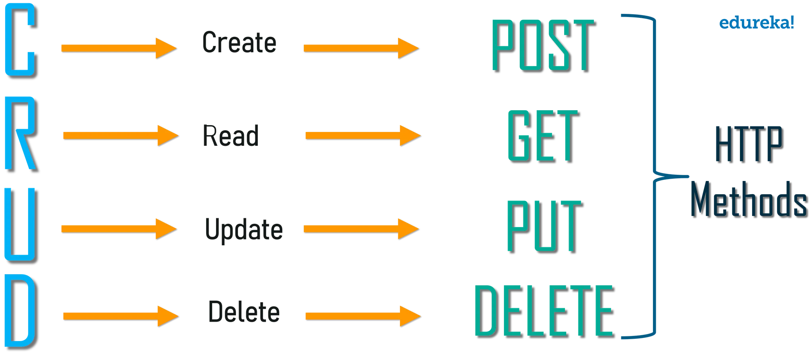

## REST API
 - Representational State Transfer
    : 표현 상태 전송 (클라이언드<==>서버)
 - Applocation Programming Interface
    : 프로그램간의 상호작용 (데이터 교환)
    
 - 구성 요소
    1. resource(자원) : URL(/feeds/:feed_id)
        - url형식을 통해 서버에 데이터 요청
    2. method, status(행위) : HTTP method
        - GET : 리소스 조회 (read)
        - POST : 리소스 생성 (create)    ==> CRUD
        - PUT : 리소스 수정 (update)
        - DELETE : 리소스 삭제 (delete)
    3. representation (표현)
        - 서버에서 클라이언트에 데이터 전달 방법 ex) xml,text,rss, 'JSON'<-많이씀
    
## jsonfy
 - 